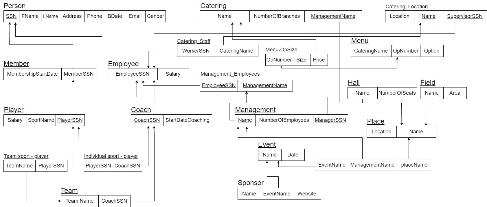

# COMP207 Project: Club Database

## Team Code

### AANSS

## Team Members

- **Ahmed Ashraf** --- [@Alucard0100](https://github.com/Alucard0100)
- **Ahmed Khaled** --- [@a04k](https://github.com/a04k)
- **Noureen Ahmed** --- [@Noureen-Ahmed](https://github.com/Noureen-Ahmed)
- **Seif Mohamed** --- [@sabdelmoniem](https://github.com/sabdelmoniem)
- **Sherif Lotfy** --- [@Sherif-Lotfy](https://github.com/Sherif-Lotfy)

 ## Project Components

  ### Schemas
  ---
-  **EER- Enhanced Entity Relationship**
  

- **RM- Relational Model**
  

### Generating the Data for Inserts
---
   Writing and creating data for people manually would have taken a very long time especially when dealing with a whole lot of it so, to save time we built a program that could give insert statements to fill up the tables.

  ```python
import random
import datetime

def genData():
    downtown_streets = ["El Tahrir", "Talaat Harb", "Al Falaky", "26 July St", "Champeleon", "Sherif", "Adly"]
    zamalek_streets = ["Abou El Feda", "Bahgat Ali", "Taha Hussein", "Gezira", "Hassan Sabry", "Shagaret Al Dor", "Hassan Assem", "Ahmed Heshmat", "kamal Al Tawil", "Mohammed Mazhar"]
    imbaba_streets = ["18St. , ElTahrir City", "28St. ,ElTahrir City", "Talaat Harb", "Mamdouh Salem"]
    al_doqi_streets = ["Shaheen", "Gad Eid", "Hassan Ramadan"]
    helopolis_streets = ["Baghdad", "Al Merghany", "Al Ahram", "Al Nozha", "Al Hegaz", "Salah El Din"]
    shobra_streets = ["Shobra St.", "Ahmed Helmy", "Doletyan", "Rod El Farag", "Al Teraa Al Boulakeya", "Kholousi", "Al Khamrawaya", "15 May"]
    salam_streets = ["Gamal Abdel Nasser", "El Sadat"]
    maadi_streets = ["Al Saad Al Aaly","Al Nahda","Damascus","Oraby", "9 St.","Al Kanal","151 St.", "Al Nadi"]
    area = random.choice(['Downtown', 'Zamalek', 'Imbaba', 'Al Doqi', 'Heliopolis', 'Shobra', 'Al-Salam', 'Maadi'])
    street = ""
    random_number = random.randint(1, 100) #for building no 
    if area == 'Downtown':
        street = random.choice(downtown_streets)
        city = 'Cairo'
    elif area == 'Zamalek':
        street = random.choice(zamalek_streets)
        city = 'Cairo'
    elif area == 'Imbaba':
        street = random.choice(imbaba_streets)
        city = 'Giza'
    elif area == 'Al Doqi':
        street = random.choice(al_doqi_streets)
        city = 'Giza'
    elif area == 'Heliopolis':
        street = random.choice(helopolis_streets)
        city = 'Cairo'
    elif area == 'Shobra':
        street = random.choice(shobra_streets)
        city = 'Cairo'
    elif area == 'Al-Salam':
        street = random.choice(salam_streets)
        city = 'Cairo'
    elif area == 'Maadi':
        street = random.choice(maadi_streets)
        city= 'Cairo'
  #name part
    nameM = ["Ahmed","Seif","Sherif","Marawan","Ehab","Kareem","Omar","Amr","Amir","Zeyad","Rashad","Abdallah","Abdelrahman","Ali","Wael","Mohamed","Mahmoud","Yousif","Mostafa","Adham","Ibrahim","Eyad","Abdalaziz","Haytham"]
    nameF = ["Aya","Amal","Amani","Omnya","Arwa","Nour","Rahma","Shahd","Noureen","Mariam","Nada","Esraa","Hager","Nourhan","Yasmin","Yara","Dina","Hana","Salma","Toaa","Eman"]  
    gender = random.choice(['M', 'F'])  
    if gender == 'M':
        first_name = random.choice(nameM)
    else:
        first_name = random.choice(nameF)
  
    L_name = [ "Mohamed","Khaled","Ashraf","Waleed","Emad","Sayed","Yaser","Magdy","Adel","Nader","Sobhi","Hani","Hassan","Farag","Salah","Ghanim","Khalil","Zakaria","Fawzi","Ezzat" ]
    last_name = random.choice(L_name)

    return first_name, last_name , gender , f"{random_number} {street}, {area}, {city}"


def ssnGen():
    while True:
        nSSN = random.randint(100, 999)
        if nSSN not in used_ssn:
            used_ssn.add(nSSN)
            return nSSN

used_ssn = set()


def genPerson():
    Fname, Lname, gender, address = genData()
    name = Fname + Lname
    SSN = ssnGen()
    person = {
        'SSN': SSN,
        'Fname': Fname,
        'Lname': Lname,
        'address': address,
        'email': name + str(random.randint(0, 420)) + '@' + random.choice(['gmail.com', 'hotmail.com', 'outlook.com']),
        'phone_number': random.choice(['010', '011', '012', '015']) + ''.join([str(digit) for digit in random.sample(range(10), 8)]),
        'birthdate': datetime.date(random.randint(1940, 2016), random.randint(1, 12), random.randint(1, 28)),
        'gender': gender
    }
    return person

personData = [genPerson() for _ in range(250)]
sql_insert_statement = "INSERT INTO Person (SSN, Fname, Lname, Address, PhoneNumber, Bdate, Gender, Email) VALUES\n "

for person in personData:
    values = f"({person['SSN']}, '{person['Fname']}', '{person['Lname']}', '{person['address']}', '{person['phone_number']}', '{person['birthdate']}', '{person['gender']}', '{person['email']}'),\n"
    sql_insert_statement += values

with open('genData.txt', 'w') as file:
    file.write(sql_insert_statement)

print("-> done")
```

  This data generator code can then be edited so we generate data for specific groups, so we could fill up the tables with the data required, and just add all of it into the Person superclass.
  P.S : theres a C++ version of this code too, just not updated though.

  ### Data Inserts
  ---
    ```


    ```

 ###  Queries
 ---
 We had plenty of query ideas, seeing that we have a whole lot of tables and data to work with but we settled on the following 20:

  ``` 


  ```
